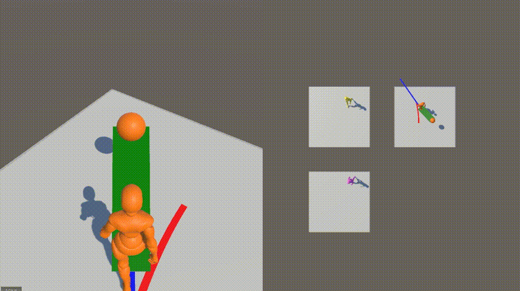
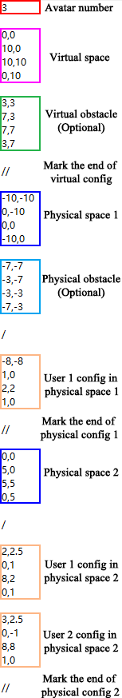
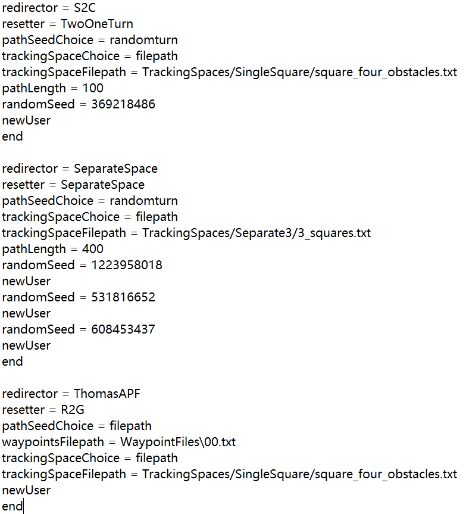
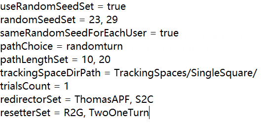
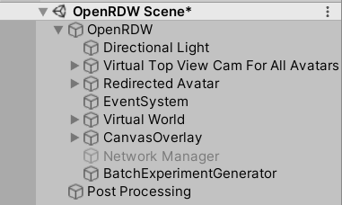

[omegafantasy/OpenRDW2: A Redirected Walking Evaluation Toolkit Supporting Multi-user online VR. An extended version of OpenRDW that supports some new features.](https://github.com/omegafantasy/OpenRDW2)

[Introduction · yaoling1997/OpenRDW Wiki](https://github.com/yaoling1997/OpenRDW/wiki/Introduction)

**실험 과정:**
1. Redirector / Resetter 구현
2. Tracking Space 설정
3. Command File / Batch File 설정 (또는 에디터에서 Global Configuration 설정)
4. Play
5. 실험 결과 확인

## Project Structure

메인 씬: `Assets/OpenRDW/Scenes/OpenRDW Scene.unity`

스크립트 (.cs): `Assets/OpenRDW/Scripts/`
- `Experiment`: 실험 관련 코드가 포함되어 있으며 실험 통계를 기록하는 역할을 담당합니다.
- `Movement`: 아바타의 움직임을 제어하는 코드들이 있으며, 이 중 `MovementManager.cs`가 가장 핵심적인 파일입니다.
- `Networking`: 네트워크 실험이 필요할 때 사용되는 PUN2 관련 코드들이 포함되어 있습니다.
- `Others`: 이 프로젝트의 가장 중요한 파일인 `GlobalConfiguration.cs`가 위치해 있으며, 이를 통해 대부분의 매개변수를 설정하고 전체 실험 과정을 제어합니다.
- `Redirection`: 여러 종류의 리다이렉터(Redirector)와 리세터(Resetter)가 구현되어 있으며, `RedirectionManager.cs`가 이들을 통합 관리합니다.
- `Visualization`: Unity 씬 내부의 시각화 효과에 중점을 둔 코드들이 모여 있습니다.

실험 구성, 경로, 결과 데이터 등을 다루는 폴더들은 다음과 같습니다:

- `BatchFiles/` 및 `CommandFiles/`: 대규모 시뮬레이션 실험을 수행하기 위한 설정 텍스트 파일들이 저장됩니다.
- `Experiment Results/`: 수행된 모든 실험의 결과 및 통계 자료가 저장되는 디렉토리입니다.
- `TrackingSpaces/`: 실험의 가상 환경, 물리적 환경, 그리고 아바타의 초기 포즈를 구성하는 텍스트 파일들이 포함되어 있습니다.
- `WaypointFiles/`: 실험 중 아바타가 지나가게 될 웨이포인트(waypoint)의 좌표들이 저장되어 있습니다.

## Redirector / Resetter 구현

> Redirector는 미묘한 조작을, Resetter는 명시적 조작을 담당합니다. 새로운 알고리즘에 따라 Redirector 및 Resetter를 구현하고 이를 RedirectionManager에 추가합니다.

**Redirector**

`Assets/OpenRDW/Scripts/Redirection/Redirectors` 폴더 내에 `Redirector` 클래스의 하위 클래스 생성

-> `InjectRedirection` 구현

-> `Assets/OpenRDW/Scripts/Redirection/RedirectionManager.cs`에 새로 구현한 redirector를 추가, 다음 함수를 수정

- `enum RedirectorChoice`
- `RedirectorChoiceToRedirector`
- `RedirectorToRedirectorChoice` 
- `DecodeRedirector`

**Resetter**

`Assets/OpenRDW/Scripts/Redirection/Resetters` 폴더 내에 `Resetter` 클래스의 하위 클래스 생성

-> `InitializeReset`, `InjectResetting` 구현

-> `Assets/OpenRDW/Scripts/Redirection/RedirectionManager.cs`에 새로 구현한 resetter를 추가, 다음 함수를 수정

- `enum ResetterChoice`
- `ResetterChoiceToResetter` 
- `ResetterToResetChoice`  
- `DecodeResetter`

## Tracking Space Settings

> Tracking Space는 아바타가 보행하는 가상 환경 및 물리적 환경을 의미합니다. 각 환경에 대한 정보를 하나의 텍스트 파일로 작성합니다.

예시 파일: `TrackingSpaces\Separate3\3_squares.txt`

마크 (//) 를 통해 각 섹션을 구분

- Avatar number: 실험에 참여하는 **사용자(또는 아바타)의 수**
- Virtual space / Virtual obstacle: 가상 환경, 반시계 방향으로 꼭짓점 좌표를 나열
- Physical space / Physical obstacle: 물리적 환경, 반시계 방향으로 꼭짓점 좌표를 나열, 마크(/) 를 통해 각 물리적 환경을 구분
- User config: 각 사용자의 **물리적 위치, 물리적 방향, 가상 위치, 가상 방향**의 네 가지 좌표, 특별한 상황이 아니라면 가상 환경에서의 포즈를 물리적 환경의 포즈와 일치시키는 것이 권장됨

## Batch Experiments

> 실험에 사용할 redirector, resetter, tracking space 및 실험 조건을 텍스트 파일 형식으로 작성합니다. 이후 실험 시에 해당 텍스트 파일을 선택하여 실험을 진행합니다.

[Command Files · yaoling1997/OpenRDW Wiki](https://github.com/yaoling1997/OpenRDW/wiki/Command-Files)

예시: `\CommandFiles`, `\BatchFiles`

에디터 내 `BatchExperimentGenerator` 오브젝트를 이용해 배치 파일을 커맨드 파일로 변환

**Command File**

- `redirector`
- `resetter`
- `pathSeedChoice`: 웨이포인트(Waypoint)의 생성 패턴
	- `pathSeedChoice = randomturn`: 웨이포인트의 분포를 무작위로 결정 
- `trackingSpaceChoice`: Tracking Space를 파일 경로 또는 사전 생성된 환경으로 지정
- `pathLength`: 아바타가 보행하는 경로의 길이 (길수록 실험 시간이 길어짐)
- `randomSeed = .. , newUser`: 실험에 참가하는 아바타를 추가 (랜덤 시드 값이 달라지면 해당 아바타의 웨이포인트 생성 패턴도 달라짐)
- `end`: 실험 시도 (Trial) 1회 종료를 의미

**Batch file**

## Global Configuration

> command file과 같은 실험 조건 설정을 에디터 UI 상에서 OpenRDW 오브젝트를 통해 진행할 수 있습니다. 

에디터 - OpenRDW 오브젝트에서 설정

**Experiment (실험 설정)**
- `Movement Controller`: 아바타의 실제 움직임을 제어하는 방식으로, 시뮬레이션에서는 주로 **Auto Pilot**을 사용하고, 실제 사용자 대상 실험에서는 **HMD**를 사용합니다.
- `Synchronized Reset`: 다중 사용자 시뮬레이션에서 중요한 설정으로, **모든 아바타가 리셋을 동시에 시작하고 종료**할지를 결정합니다.
- `Run In Backstage`: 체크할 경우 시각화 없이 백그라운드에서 실행되어 시뮬레이션 속도가 매우 빨라지므로 **일괄 실험(batch experiments) 시 권장**됩니다. 체크하지 않을 경우 시뮬레이션 과정을 눈으로 확인할 수 있습니다.
- `Load From Txt`: 체크 시 UI 패널의 설정 대신 **미리 준비된 명령 파일(command file)** 을 로드하여 실험을 진행합니다. Play 버튼을 누르면 파일 탐색기에서 명령 파일을 선택할 수 있습니다.
- `Use Reset Panel`, `Use Crystal Waypoint`: 실제 사용자 실험 전용 설정
- `Path Length`, `DEFAULT_RANDOM_SEED`: 시뮬레이션 전용 설정

**Avatar (아바타 설정)**
- `Avatar Num`: 실험에 사용될 아바타의 수를 제어하며, 단일 사용자 실험의 경우 1로 설정합니다.
- `Translation Speed`, `Rotation Speed`: 아바타의 걷는 속도와 회전 속도를 결정합니다.

**Tracking Space (트래킹 공간 설정)**
- `Tracking Space Choice`: 물리적 트래킹 공간으로 커스텀 환경을 사용할지, 사전 정의된 환경을 사용할지 결정합니다.
- `Tracking Space File Path`: 물리적 트래킹 공간으로 커스텀 환경을 사용할 경우, 이를 **File Path**로 설정한 뒤 **Tracking Space File Path** 슬롯에 로컬 텍스트 파일을 지정하여 사용자 지정 공간을 불러올 수 있습니다.
- `Obstacle Type`, `Obstacle Height`, `Square Width`: 사전 정의된 공간을 사용할 경우 **Obstacle Type(장애물 유형)**, **Obstacle Height(장애물 높이)**, **Square Width(사각형 너비)** 를 통해 세부 설정을 제어합니다.

**Path (경로 설정)**
- `Draw Real Trail`, `Draw Virtual Trail`: 실제 경로와 가상 경로의 궤적을 화면에 표시할지 여부를 제어합니다.
- `Trail Visual Time`: 경로 궤적이 화면에 유지되는 시간을 결정합니다.

**Analysis 및 Statistics Logger (분석 및 로그 설정)**
- `Export Image`: 걷기 과정의 이미지 내보내기 여부를 제어합니다.
- `statisticsLogger`: **Log Sample Variables**를 체크하면 실험 중 발생하는 변수들을 기록하며, 내보낸 이미지와 실험 결과는 기본적으로 `Experiment Results/` 디렉토리에 저장됩니다.

**Redirected Avatar (OpenRDW의 child object)**
- `Redirector Choice`: subtle redirection controller의 타입을 결정
- `Resetter Choice`: overt redirection controller의 타입을 결정
- `Path Seed Choice`: waypoints 의 분포를 결정하는 랜덤 시드

## Experiment Results

> Play 버튼을 눌러 실험을 진행한 후, 실험 결과를 csv 파일 및 그래프를 통해 확인합니다.

실험 결과는 `../Project Root/Experiment Results`에 저장됨

- `/Summary Statistics`: 실험 전체 결과 요약, 각 실험 시도(Trial)별로 아바타마다 실험 지표를 기록
- `/Sampled Metrics`: 상세 지표를 프레임 단위로 기록
	- Sampling Frequency: 에디터의 Global Configuration - Statistics Logger 에서 변경 가능
- `/Graph`: 물리적 환경에서 아바타의 진행 경로를 시각화한 그래프

## Acknowledgments

This project is built upon and inspired by the following repositories:

[OpenRDW2](https://github.com/omegafantasy/OpenRDW2)

[OpenRDW](https://github.com/yaoling1997/OpenRDW)